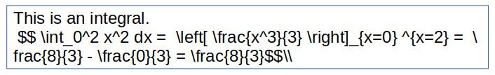
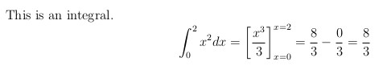
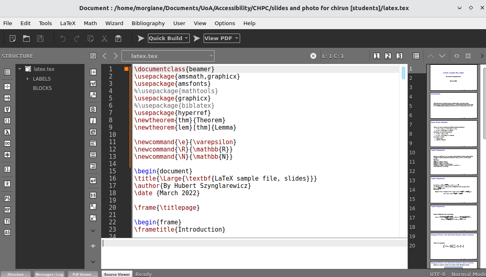
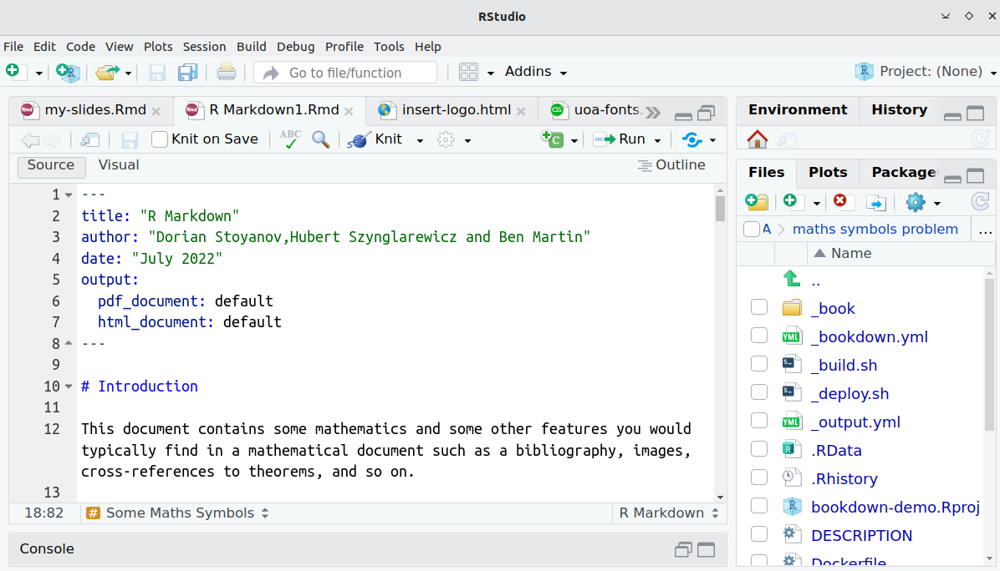

```{r setup, include = FALSE}
library(knitr)
library(tidyverse)
library(NHSRtheme)
# set default options
opts_chunk$set(echo = FALSE,
               fig.width = 7.252,
               fig.height = 4,
               dpi = 300)

# uncomment the following lines if you want to use the NHS-R theme colours by default
# scale_fill_continuous <- partial(scale_fill_nhs, discrete = FALSE)
# scale_fill_discrete <- partial(scale_fill_nhs, discrete = TRUE)
# scale_colour_continuous <- partial(scale_colour_nhs, discrete = FALSE)
# scale_colour_discrete <- partial(scale_colour_nhs, discrete = TRUE)
```

class: title-slide, left, bottom

# `r rmarkdown::metadata$title`
----
## **`r rmarkdown::metadata$subtitle`**
### `r rmarkdown::metadata$author`
### `r rmarkdown::metadata$date`

---
class: inverse, middle, center

# Universal Design for Learning and Accessibility

Why does it matter?

---
class: center, middle

# Universal Design for Learning (UDL)

--

.left[
Approach to Learning and Teaching that encourages us to reflect on .red[how we teach what we wish to teach];

Aims at .red[not creating barriers] to learning;

Aims at considering the .red[diversity of our learners] in the classroom.

]

--

.right[

Framework that provides multiple means of:

Engagement - encourages teachers to look for .blue[ways to motivate] students;

Representation - offering information in .blue[more than one format];

Action and expression - giving students .blue[more than one way to interact] with the material.
]

---
class: middle

# Digital Accessibility: Why does it matter?

Representation - .green[offering information in more than one format];

Action and expression - .green[giving students more than one way to interact with the material].

--

.center[**Digital Accessibility provides a framework to ensure the above objectives**]

---
class: middle

# Digital Accessibility: Why does it matter?

**It benefits everyone!**

`r fontawesome::fa("desktop")` `r fontawesome::fa("tablet-screen-button")` `r fontawesome::fa("mobile-screen")` Creating interactive documents that display correctly on various devices with various browsers.
  
`r fontawesome::fa("palette")` `r fontawesome::fa("font")`  Designing adaptable documents: modifying colours, fonts.
  
--

`r fontawesome::fa("face-smile")` `r fontawesome::fa("school-circle-check")` We have an obligation to support wider participation and inclusivity.

--

`r fontawesome::fa("scale-balanced")`  In the UK, it is a legal requirement: Equality Act 2012 and 2018 Public Sector Body Accessibility.

---
class: inverse, middle, center

# Accessibility for STEM Subjects

Creating accessible STEM material

---
class: middle

# Writing Mathematics

* Many teaching staff use **LaTeX** to write course material

  * Typesetting system which is particularly efficient to write advanced mathematics;
  
  * Academics use LaTeX to write all their documents (papers, research grants, presentations);
  
  * Schools and departments often have their own templates for notes, tutorials, labs and exams.

--

```{r, echo = FALSE, fig.align='left', out.width='50%'}

```


```{r echo = FALSE, fig.align='right', out.width='50%'}

```


---
class: middle

# Writing Mathematics

.left[
The problem with LaTeX ...
]

.right[... is that is generates PDF (great for printing) which are .red[not accessible]: 

not easily tagged;

incompatible with text-to-speech software;

cannot be dynamically modified by reader.
]

---
class: middle 

# Writing Mathematics

* Alternative: provide HTML formats (with Mathjax to render the maths) **in addition to PDF**.

* **Existing material** can be converted

  * Tools such as Pandoc and related packages;
  
  * .red[Do not work 100%];
  
  * Need .red[considerable time and effort] to fix content.
  
* Not a long-term solution!

---

# Writing Mathematics

* Alternatives to LaTeX for furture course material

  * Pandoc Markdown, RMarkdown and Bookdown;
  
  * Generates PDF as well as HTML files;
  
  * Mathematical objects are written in LaTeX.
  
* Academics need to be informed and trained.

.pull-left[

```{r, echo = FALSE, out.width='80%'}

```

]

.pull-right[
```{r echo = FALSE, out.width='80%'}

```

]

---
class: inverse, middle, center

# Scottish Maths Support Network (SMSN) Dissemination Work

Informing and Training

---
class: middle 

# University of Aberdeen Project


**Student project 1**

* Tested and documented a range of conversion packages.

**Student project 2**

* Staff survey to collect user feedback on conversion solutions and use of alternative languages.

* Next step: collect student feedback on material produced.

Further info: see poster .green[Creating Accessible STEM Teaching and Learning Resources].

---
class: middle 

# University of Glasgow Project

**LaTeX** (with complicated stylesheets and packages) used very heavily in Maths department.

**Student project 1:**

* Created stylesheet and RMarkdown template to ‘match’ existing notes, tutorial sheets and feedback exercise sheets 

* Tested with screenreaders and BB Ally

**Student project 2:**

* Automated process by writing Powershell scripts to ‘find and replace’ syntax from LaTeX to RMarkdown.


---
class: middle 

# SMSN Collaboration

* Complex and technical problem with no straightforward solution!

* Aim: document existing solutions and their limitations, inform and train staff.

* Means:

  * Maintain a curated toolkit and add to our current bank of resources;

  * Continue to run training workshops aimed at lecturers teaching STEM subjects;

  * Support the development of a resilient community of teachers.
  
---
class: middle

# Plans for the Toolkit

* Guidance documents

* Sample templates for alternative markup languages

* Training resources from workshops

* Alt text, Graphs and Diagrams

* Use of colour

---
class: inverse, middle, center

# Thank you `r fontawesome::fa("face-smile")`

m.richard@abdn.ac.uk

shazia.ahmed@glasgow.ac.uk

david.hodge@gcu.ac.uk